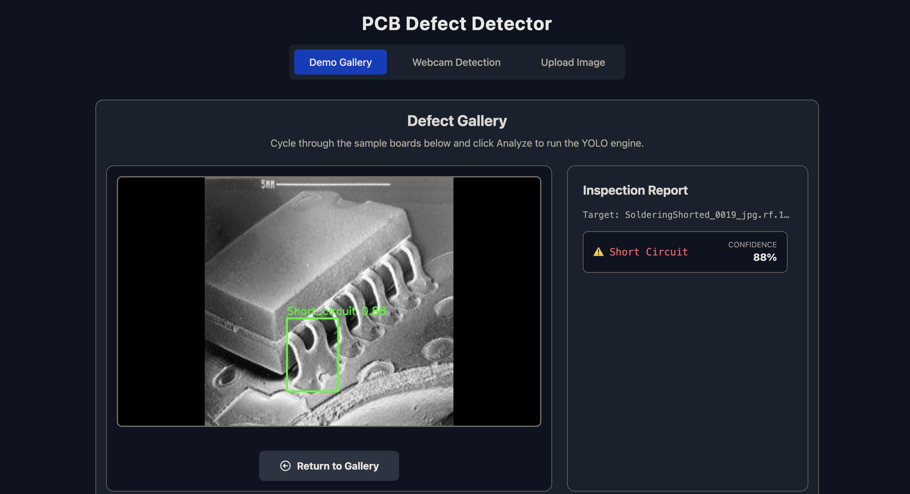
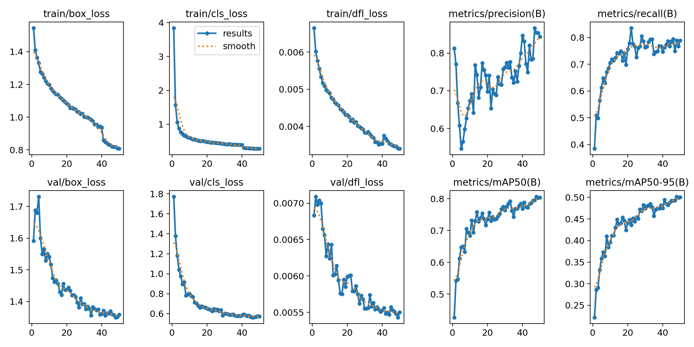
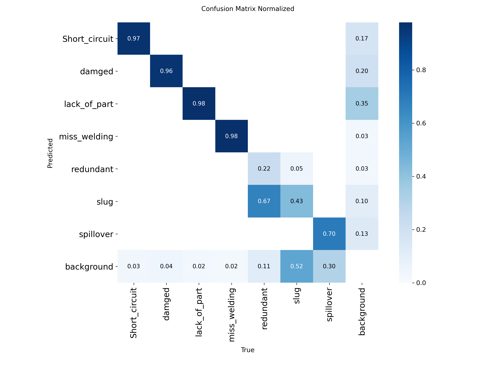

# PCB Defect Detector - Custom Trained AI Model

A real-time, full-stack computer vision dashboard designed to automate quality control for Printed Circuit Boards (PCBs).

This project bridges a high-performance Python AI engine with a modern React user interface, capable of processing both static image analysis and ultra-low latency live video streams. The entire application is containerized for zero-configuration, seamless deployment.



*Real-time inference and inspection report generation via the React + FastAPI dashboard.*

## Key Features

* **Real-Time Video Inference:** Utilizes WebSockets to stream live webcam feeds to the backend, run inference, and return bounding-box overlays at high frame rates.
* **RESTful Image Analysis:** A drag-and-drop UI that communicates with FastAPI endpoints for high-resolution static image inspection.
* **Automated Batch Simulation:** A dynamic, interactive gallery of test data for demonstration purposes.
* **Production-Ready Infrastructure:** Fully containerized using Docker Compose, utilizing a multi-stage Nginx build for the frontend and a headless Linux environment for the backend.

## Model Training & AI Architecture

The core of the inspection engine is a custom-trained object detection model, heavily optimized for real-time edge inference.

### Architecture Selection

* **Base Model:** Ultralytics YOLO26
* **Rationale:** YOLO was selected over two-stage detectors (like Faster R-CNN) due to the strict low-latency requirements of live webcam inference. The model prioritizes rapid bounding-box regression without sacrificing the mean Average Precision (mAP) required for microscopic defect detection.

### Dataset & Preprocessing

* **Source:** Roboflow Universe (PCB Defect Dataset)
* **Classes Detected:** 7 (Short, Spur, Mouse Bite, Spurious Copper, Open Circuit, Pin Hole, Lack_of_part)
* **Image Sizing:** Images were resized to 640x640 to balance GPU VRAM constraints with the spatial resolution needed to detect sub-millimeter defects.
* **Augmentations Applied:** * Rotation & Scaling (To account for misaligned boards on a conveyor)
  * Brightness/Contrast shifts (To simulate variable factory lighting conditions)
  * Mosaic Augmentation (To improve the detection of smaller, clustered defects)

### Performance Metrics

The model was evaluated on a strictly isolated validation set to ensure generalizability. The peak performance was recorded at **Epoch 48** with the following metrics:

* **Precision: 85.4%** (Low false-positive rate, ensuring healthy boards are not unnecessarily flagged for manual review)
* **Recall: 78.9%** (Strong true-positive capture rate for finding hidden defects)
* **mAP50: 80.6%** (High confidence in general defect localization)
* **mAP50-95: 50.2%** (Strict Intersection over Union thresholding)
* **Inference Speed:** Capable of sub-20ms inference per frame on standard hardware, allowing for seamless, real-time video streaming without buffering.

### Training Validation


*Training loss and validation metrics over 48 epochs.*


*Confusion matrix demonstrating high classification precision and low false-positive rates across all defect classes.*

## System Architecture

This project strictly separates the computational AI logic from the user interface presentation.

### Frontend

* **Framework:** React + Vite
* **Styling:** Tailwind CSS
* **Server:** Nginx (Alpine Linux)
* **Responsibilities:** Managing browser state, establishing WebSocket connections, handling file buffering, and rendering real-time AI overlays without frame drops.

### Backend

* **Framework:** FastAPI (Python)
* **AI/CV:** Ultralytics (YOLO) + OpenCV (Headless)
* **Server:** Uvicorn (ASGI)
* **Responsibilities:** Handling heavy matrix mathematics, running neural network predictions, and encoding/decoding Base64 image streams asynchronously.

---

## Quick Start (Docker)

**Prerequisites:** * [Docker Desktop](https://www.docker.com/products/docker-desktop/) must be installed and running.

**1. Clone the repository:**

```bash
git clone https://github.com/YOUR_USERNAME/pcb-defect-detector.git
cd pcb-defect-detector
```

**2. Build and launch the containers:**

```bash
docker-compose up --build
```

**3. Access the Dashboard:**

Open your web browser and navigate to:
<http://localhost>

(Note: The first build may take a few minutes as Docker downloads the necessary Python/Linux dependencies and compiles the React application).

## License & Data Citation

This project utilizes the following dataset for training the custom YOLO model:

* **Title:** PCB Defect Computer Vision Model
* **Author:** NBComputerVision
* **Year:** 2024
* **Publisher:** Roboflow
* **URL:** [https://universe.roboflow.com/nbmachinevision/pcb-defect-vagef](https://universe.roboflow.com/nbmachinevision/pcb-defect-vagef)
* **License:** CC BY 4.0
